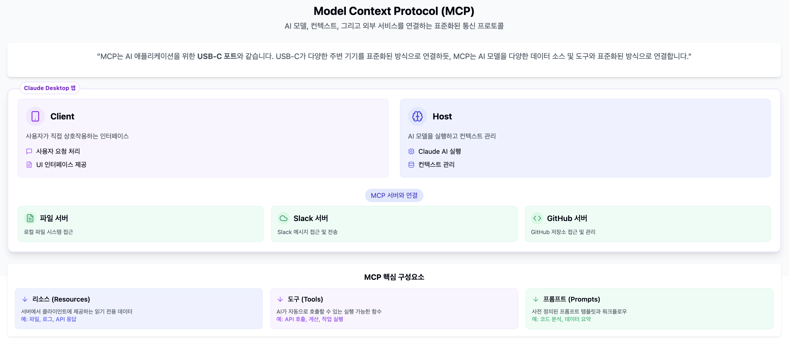

# MCP 활용 - 도구를 사용하는 AI Agent 활용

## MCP란?

- (Model Context Protocol)로 Anthropic에서 '24년 Computer Use 공개 직후 오픈 소스로 공개한 기술. API를 손쉽게 AI Agent와 통합하기 위한 표준화된 규격

- 개방형 표준
  - Anthropicㅇ듸 Claude 외 Function Call을 지원하는 모든 LLM에서 호환 가능
  - 다만, Claude가 이러한 MCP를 통한 도구 사용에 가장 뛰어난 정확도를 보인다는 평가

- 참고
  - [Ollama MCP Bridge](https://github.com/patruff/ollama-mcp-bridge)

## MCP 관련 주요 정보

- [MCP 서버 모음(공식)](https://github.com/modelcontextprotocol/servers)
- [smithery.ai](https://smithery.ai/): 다양한 MCP 도구를 공유하는 사이트

## MCP 시연

- Claude에서 웹 검색 사용
- Cursor 데모

## AI Coding Tool

- 범용
  - Claude Canvas
  - ChatGPT (Cavas 유사)
  - Manus AI
  - ...
    - 간단한 시각화, Single Page App 개발 및 공유

- SW 개발 중심 (무료 / Freemium)
  - v0.dev(Vercel)
  - Github Copilot (Github 사용자 무료 사용)
  - Amazon Q (AWS 사용자 무료 사용)
    - LLM 지원은 유료 Tool과 유사
    - 다만, 사용성이 유료툴 대비 매우 떨어짐 (Diff 생성 시 오류가 많고, 적용 시 파일 전체를 다시 쓰기하는 등..)

- SW 개발 중심 (유료)
  - Cursor (Copilot & Autopilot)
    - 가장 널리 알려진 AI 코딩툴
    - 월 $20, Fast Query 500건 제공 / Unlimited Slow Query
  - Windsurf (Copilot & Autopilot)
    - 후발 주자로 사용자의 동작에 대한 보다 깊은 이해 (최근 수정한 내역 등)를 기반으로 높은 정확도 제공 주장
    - 월 $15, 단, 초과 시 Base Model (저품질) 제공
  - Claude Code (Autopilot)
    - 가장 최근에 나온 모델로 Claude 구독 외에 추가로 API Credit 구매 필요
    - 터미널의 명령 입력만을 지원, 사용자의 직접적 코드 수정은 미지원
    - 비용이 비싼 편 (개인 테스트 시 1개의 Query에 2 ~ 3$ 사용)

## 한계

- 맥락의 이해 - "Fixing one hole creates another"
  > 정보를 활용하는것에 대한 제약이 존재, Context Size , Retrieval Accuracy에서 한계가 존재함
  - 경험상 대략 1000 Line 내외로 만들어 질 수 있는 코드에 대해 만족스러운 결과물을 생성
  - 수만 Line 이상의 작업이 필요한 경우 생성 시 규모가 증가할 수록 오류 증가 (Trial and Error Iterationㅌ으로 낭비되는 토큰이 크게 증가하는 경향)

- 수행의 정확도
  > Foundation Model 출력의 화률적 특성 및 Hallucination 등이 존재, 이로 인해 비슷한 결과물 내지 초안 작성이 가능한 수준이나, 완결성있는 결과물을 생성하는데 한계
  - 지시의 정확도와 세밀함에 따라 의도와 적합도가 높은 결과물이 나오기도 하지만 기획자나 디자인의 의도를 엄밀하게 반영하기 어려움 (Drafting 할 때 유용한 측면이 있음) (예: AI 피라미드 시각화)

- 비용에 대한 불확실성
  > 고정 요금제 방식의 일부 서비스 제외, Pay-as-you-go 방식의 Autopilot Agent(Claude Code)의 경우 주어진 Task에 얼마나 많은 비용을 쇼요할지 예측이 어려움
  - 작업 결과물의 품질, 오류 정정 과정의 효율성 등 과정 수행에 있어서 수준의 편차가 존재하며 전체 Budget 수준에 대한 예측 가능성을 낮추는 측면이 존재함
