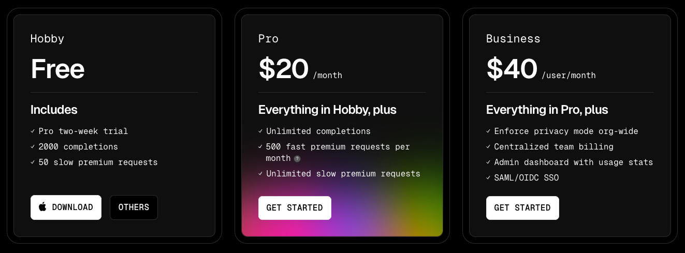
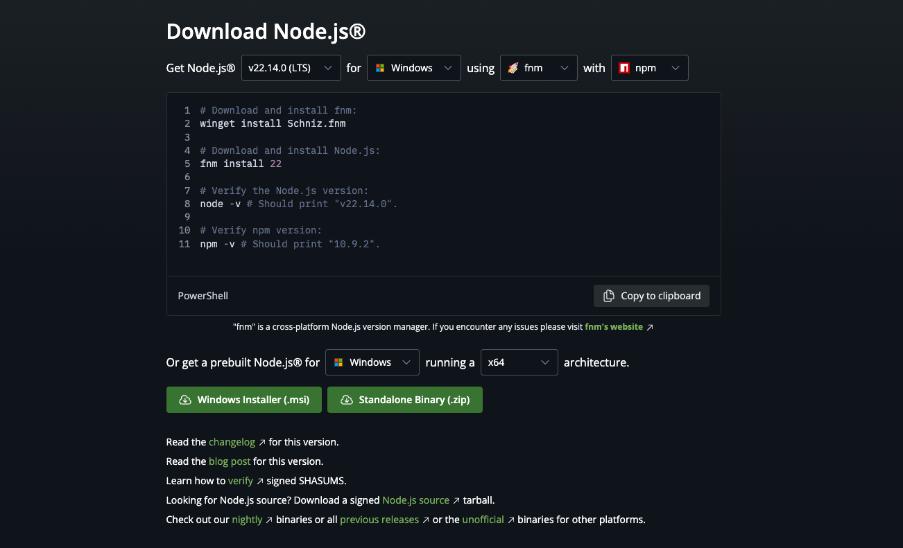

# Cursor 활용 따라하기 세션 사전 준비

## Cursor 설치 및 계정 생성

### 다운로드 및 설치

- [다운로드 페이지](https://www.cursor.com/downloads)
- [설치 가이드 영상](https://www.youtube.com/watch?v=vOn9S4zh1Qs)

### 요금제 선택 (무료 2주 Trial 사용 가능)

## Node JS 설치

> MCP를 설치하기 위해 필수

- [Node.js 인스톨러 다운](https://nodejs.org/en/download)

